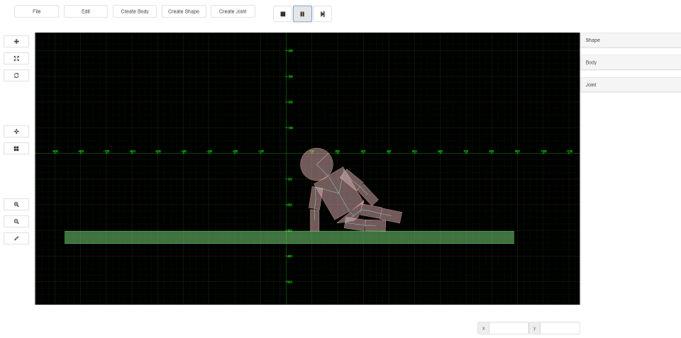
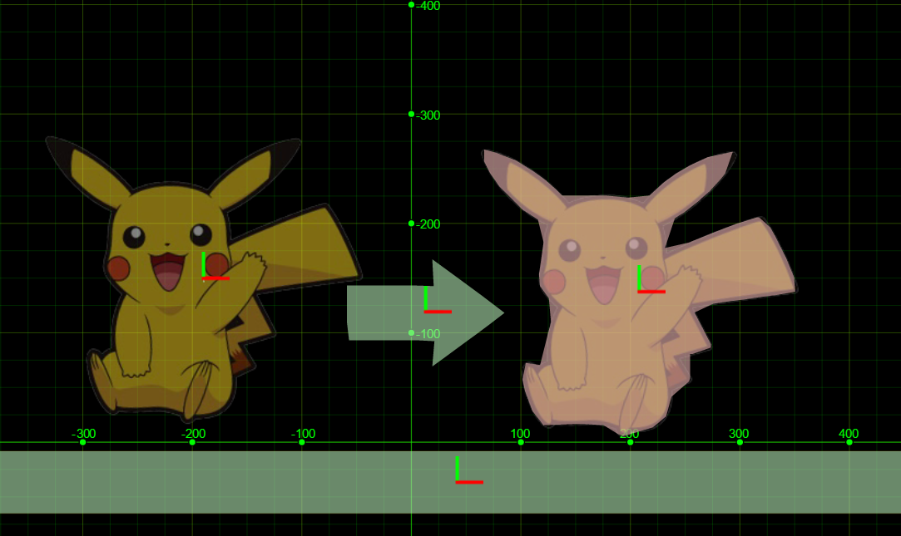

Physics Editor
==============

Physics Editor is a lightweight, browser-based Box2d physics world editor and simulator



Features
--------

* Uses [Box2d](http://box2d.org/) for physics simulation
* Easy to use interface and visualization of box2d world
* Creating and exporting entire 2d scene, bodies or shapes
* Graphical user interface to create and edit bodies, shapes and joints
* Support for concave shapes
* Auto trace to generate shapes from 24-bit bitmap image
* Supports javascript console to edit scene using custom scripts

Demo
-----

[Demo Link](http://amutbkt.github.io/Physics-Editor/editor.html)

Usage
-----

editor.html launches the editor

#### Editor

Editor object drives the entire editor
```javascript
Editor.viewport;		// handles all the canvas events and rendering
Editor.sceneManager;	// handles selecting and editing objects
Editor.uiManager;		// handles dom events
Editor.gameView;		// handles physics simulation

Editor.resourceDirectory = "directory containing textures";	// defaults to ./resources

// auto trace image shape generation paramters
Editor.autoTrace = {
	xSpace : 1.0,
	ySpace : 1.0,
	concavity : 20
};

Editor.getCurrentSelection();	// returns an array of selected objects
Editor.getSelectedBodies();		// returns an array of selected bodies
Editor.getSelectedShapes();		// returns an array of selected shapes
Editor.getSelectedVertices();	// returns an array of selected vertices
Editor.getSelectedJoints();		// returns an array of selected joints 
```
Sample scenes are provided in the ./resources directory

#### Body
Equivalent to b2Body from Box2d

#### Shape
Equivalent to b2Shape from Box2d
Shapes can be created only when editing a body
```javascript
// shape types
Shape.SHAPE_BOX      	// rectangle shape, vertices cannot be edited, equivalent to b2PolygonShape.setAsBox
Shape.SHAPE_CIRCLE 		// cicle shape, vertices cannot be edited, equivalent to b2CircleShape
Shape.SHAPE_POLYGON 	// vertices can be edited, equivalent to b2PolygonShape.set([vertices])
Shape.SHAPE_CHAIN 		// vertices can be edited, equivalent to b2ChainShape
````

#### Vertex
Equivalent to b2Vec2 with an exception that it stores data as array [pos_x, pos_y]

#### Joint
Equivalent to b2Joint
To create a joint, select 2 bodies
```javascript
// joint types
Joint.JOINT_DISTANCE      	// fixed distance between bodies
Joint.JOINT_WELD 			// bodies are glued to each other
Joint.JOINT_REVOLUTE 		// bodies can rotate about localAnchorB
Joint.JOINT_WHEEL 			// wheel - axle joint
Joint.JOINT_PULLEY          // bodies suspended from pulley
Joint.JOINT_GEAR 			// a body can drive another body using either revolute/prismatic joint
Joint.JOINT_PRISMATIC 		// a body's translation can be constrained along an axis (localAxis)
Joint.JOINT_ROPE 			// distance between two bodies can be constrained
````
How to create joints:
* To create distance joint, select two bodies -> create distance joint
* To create weld joint, select two bodies -> create weld joint
* To create revolute joint, select two bodies -> create revolute joint
* To create wheel joint, select two bodies -> create wheel joint
* To create pulley joint, select two bodies -> create pulley joint
* To create gear joint, select two bodies and either two revolute or two prismatic joints or one revolute and one prismatic joint -> create gear joint
* To create prismatic joint, select two bodies -> create prismatic joint
* To create rope joint, select two bodies -> create rope joint

#### PolygonHelper
[Mark Bayazit's Algorithm](http://mpen.ca/406/bayazit) is used to decompose concave shapes. Concave shape is decomposed to array of convex shapes, as Box2d supports only convex shapes

#### Auto Trace
[Concave Hull generation](https://github.com/AndriiHeonia/hull) to create shapes from bitmap image easily. To use auto trace, select "Shape From Bitmap" from "Create Shape" dropdown. Image should be grayscale with shape blocked in white color and background (area to be clipped) in black. Sample image (pika.bmp) is provided in the /resources folder.



#### Loading Scene
You can export scene created in editor as json file (structure for the same is available in /resources/loaders folder), which can then be loaded in game engine. Currently there are loaders available for [LibGdx](http://libgdx.badlogicgames.com/)(Java), Box2d-Web(Javascript), Cocos2d-x (c++), Apple's Sprite Kit (objective-c) and Unity3D in /resources/loaders folder
##### To use Cocos2d-x loader:
```cpp
	// make sure to add your resources folder (folder containing json file) to cocos2dx search path
	cocos2d::FileUtils::getInstance()->addSearchPath("your_folder");

	Box2dWorldLoader *loader = new Box2dWorldLoader();
	loader->setOffset(x, y);	// to translate world
	loader->loadJsonScene("file.json", b2world*);

	// to debug draw physics world just add an instance of b2DegugLayer to your current scene's layer
	yourNodeOrLayer->addChild(b2DebugLayer::create(b2world*, pixel_to_meter_ratio), ZOrder);
````
#####Example Projects
[Unity Sample Project](https://github.com/amuTBKT/Unity-PhysicsWorldLoader)

[SpriteKit Sample Project](https://github.com/amuTBKT/SpriteKit-PhysicsWorldLoader)

UI
--

#### Navigation

* <kbd>Left Click</kbd> drag to select multiple objects
* <kbd>Right Click</kbd> drag to pan around
* <kbd>Scroll Wheel</kbd> to zoom in and out

#### Hot Keys

* <kbd>Shift</kbd> + <kbd>D</kbd> to duplicate selection
* <kbd>Delete</kbd> to delete selection
* <kbd>w</kbd> to select translate tool
* <kbd>r</kbd> to select scale tool
* <kbd>e</kbd> to select rotate tool
* <kbd>s</kbd> to toggle snapping to grid
* <kbd>j</kbd> while selecting to mask bodies
* <kbd>b</kbd> while selecting to mask joints
* <kbd>Ctrl</kbd> + <kbd>Left Click</kbd> to add vertex to a shape while editing

##### Editing Joints:

Weld Joint
* <kbd>Shift</kbd> + <kbd>Left Click</kbd> drag on bodyA while in edit mode to change reference angle

Revolute Joint
* <kbd>Shift</kbd> + <kbd>Left Click</kbd> drag on bodyA while in edit mode to change reference angle
* <kbd>Shift</kbd> + <kbd>Left Click</kbd> drag on bodyB while in edit mode to change upper angle limit
* <kbd>Left Click</kbd> drag on bodyB while in edit mode to change lower angle limit

Wheel Joint
* <kbd>Shift</kbd> + <kbd>Left Click</kbd> drag on bodyA while in edit mode to change localAxisA

Prismatic Joint
* <kbd>Left Click</kbd> drag on bodyA while in edit mode to change localAxisA
* <kbd>Shift</kbd> + <kbd>Left Click</kbd> drag on bodyA while in edit mode to change reference angle
* <kbd>Shift</kbd> + <kbd>Left Click</kbd> drag on bodyB while in edit mode to change upper translation limit
* <kbd>Left Click</kbd> drag on bodyB while in edit mode to change lower translation limit 

Scripting
---------

Editor can utilize javascript console to edit scene through scripts
```javascript
// an example to make copies of selected body
// select a body to clone
// creating a circular pattern here
var radius = 200, resolution = 10;
for (var i = 0; i < resolution; i++){
	// clone the selected body
	var b = Editor.getCurrentSelection()[0].clone();
	// set position of the body created
	b.setPosition(radius * Math.cos(i * 2 * Math.PI / resolution), radius * Math.sin(i * 2 * Math.PI / resolution));
	// add body to the scene
	Editor.getSceneManager().addBody(b);
}
```

Issues
------

* Wheel and Rope Joints are not supported in Box2d-Web, but works with the LibGDX loader
* Undo/Redo not available
* Unstable on firefox 

License
-------

Physics Editor is available under MIT license
